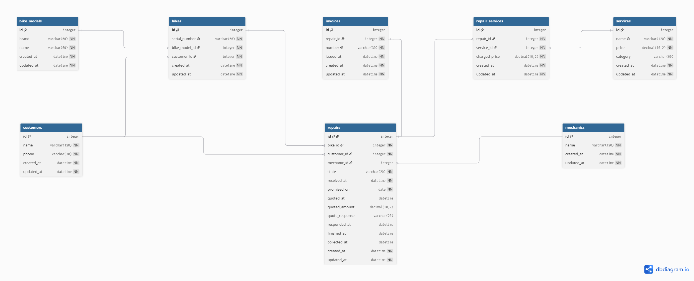

# Domain Model



*(The image above is the Lab 3 export and is now stale — it doesn't yet reflect the changes below. To
update it: paste the DBML block into [dbdiagram.io](https://dbdiagram.io), export the new PNG, and
replace `images/domain-model.png`. Claude can't drive that site, so this step is Santiago's to do by
hand.)*

```dbml
Table customers {
  id integer [pk, increment]
  name varchar(120) [not null]
  phone varchar(30) [not null]
  created_at datetime [not null]
  updated_at datetime [not null]
}

Table bike_models {
  id integer [pk, increment]
  brand varchar(60) [not null]
  name varchar(60) [not null]
  created_at datetime [not null]
  updated_at datetime [not null]
}

Table bikes {
  id integer [pk, increment]
  serial_number varchar(60) [not null, unique]
  bike_model_id integer [not null]
  customer_id integer [not null]
  created_at datetime [not null]
  updated_at datetime [not null]
}

Table mechanics {
  id integer [pk, increment]
  name varchar(120) [not null]
  created_at datetime [not null]
  updated_at datetime [not null]
}

Table services {
  id integer [pk, increment]
  name varchar(120) [not null, unique]
  price decimal(10,2) [not null]
  category varchar(60)
  created_at datetime [not null]
  updated_at datetime [not null]
}

Table repairs {
  id integer [pk, increment]
  bike_id integer [not null]
  customer_id integer [not null]
  mechanic_id integer
  state varchar(20) [not null, default: 'received']
  received_at datetime [not null]
  promised_on date [not null]
  quoted_at datetime
  quoted_amount decimal(10,2)
  quote_response varchar(20)
  responded_at datetime
  finished_at datetime
  collected_at datetime
  created_at datetime [not null]
  updated_at datetime [not null]
}

Table repair_services {
  id integer [pk, increment]
  repair_id integer [not null]
  service_id integer [not null]
  charged_price decimal(10,2) [not null]
  created_at datetime [not null]
  updated_at datetime [not null]
}

Table invoices {
  id integer [pk, increment]
  repair_id integer [not null, unique]
  number varchar(30) [not null, unique]
  issued_at datetime [not null]
  created_at datetime [not null]
  updated_at datetime [not null]
}

Ref: bikes.bike_model_id > bike_models.id
Ref: bikes.customer_id > customers.id
Ref: repairs.bike_id > bikes.id
Ref: repairs.customer_id > customers.id
Ref: repairs.mechanic_id > mechanics.id
Ref: repair_services.repair_id > repairs.id
Ref: repair_services.service_id > services.id
Ref: invoices.repair_id - repairs.id
```

*(The `Ref:` lines are dbdiagram.io's notation for the relationship a foreign-key-style column implies —
they document intent for the diagram. The database itself enforces none of them yet: no foreign key
constraint exists this lab, see "Changes since Lab 3" below.)*

## Changes since Lab 3

- **Every table gains `created_at`/`updated_at`.** Rails convention, required by Lab 5's requirement 2;
  the Lab 3 diagram didn't model timestamps explicitly.
- **`repairs.promised_date` renamed to `repairs.promised_on`.** Lab 5's naming rule is `_on` for a day
  column, `_at` for an instant; the Lab 3 name held a day but didn't follow that suffix.
- **`repairs.diagnosis` removed.** Lab 5 explicitly defers free-text diagnosis to Lab 9.
- **The `photos` table removed from this diagram entirely.** Deferred to Lab 9 alongside the diagnosis
  text; nothing else in the schema references it, so removing it leaves no dangling relationship.
- **`services.category` added** (`varchar`, nullable). Supports the price list's grouped display (Tires
  & tubes, Brakes, Drivetrain, …) on the Services page. Not part of the shop's original Lab 3
  description, but a low-risk addition that keeps that page's existing grouping working now that it
  reads from the database instead of a hardcoded array.
- **`services.name` given a unique index.** The shop doesn't sell two services under the same name; the
  Lab 3 diagram didn't mark this, but Lab 5's own requirement text calls out "the name of a service" as
  an example directly.
- **No foreign key constraints added at the database level.** `bike_model_id`, `customer_id`,
  `mechanic_id`, `bike_id`, `service_id` and `repair_id` are plain columns today. Lab 5 reserves the
  constraint — and the Active Record association that uses it — for Lab 7.
- **No `colour` column added to `bikes` or `bike_models`.** The seed data's "two bikes, same make, model
  and colour" case is represented with two bikes sharing a `bike_model_id` and differing only in
  `serial_number`. Colour itself isn't required by any Lab 5 requirement and isn't tracked yet.

`repairs.customer_id` is the customer who brought the bike in on that visit. `bikes.customer_id` is who owns it now. They are usually the same person and differ once the bike is sold, which is exactly the case the owner cares about.

## Lifecycle of a repair

States: `received`, `diagnosed`, `quoted`, `approved`, `declined`, `in_progress`, `finished`, `collected`.

Allowed transitions:

| From | To | When |
|---|---|---|
| received | in_progress | The job is obvious and cheap — a flat tyre going out the same afternoon. No quote needed. |
| received | diagnosed | The mechanic looks at it properly and writes down what is wrong. |
| diagnosed | quoted | The customer is called and told the price. |
| quoted | approved | The customer says yes. |
| quoted | declined | The customer says no. |
| approved | in_progress | The mechanic starts work. |
| in_progress | finished | The work is done and the bike is waiting on the rack. |
| finished | collected | The customer takes the bike away. |
| declined | collected | The customer takes the bike away exactly as it arrived. |

Not allowed, and why:

- **received → finished.** Nothing can be finished that was never worked on. Every repair passes through `in_progress`.
- **quoted → in_progress.** The owner is explicit: wait for them to say yes before touching it. Work cannot begin without an answer.
- **declined → in_progress.** A declined quote is a refusal. If the customer changes their mind, that is a new repair, not a revived one.
- **collected → anything.** `collected` is terminal. A bike that comes back is a new repair on the same bike, which is what makes the bike's history readable.
- **finished → in_progress.** Rework is a new repair. Reopening one would let a finished invoice change, which is the thing the owner says must not happen.

## Every entity traces back to a story

| Entity | Story that requires it |
|---|---|
| customers | 1 — the name and phone written on the paper tag |
| bike_models | 1 — "a Trek Marlin, a Giant Escape", picked from a list so the same model is written the same way every time |
| bikes | 1 — the serial number, so two blue Marlins are two rows |
| mechanics | 5 — a mechanic sees the bikes waiting **for them**, which requires knowing who is who |
| repairs | 1 — the visit itself, created when the bike arrives |
| services | 14 — the wall list published on the website, with a price each |
| repair_services | 7 — the two or three services a bike needs, each at the price actually charged |
| invoices | 18 — the record of what was charged, issued when the bike is collected |

`photos` isn't in this table because it isn't in the schema yet — see "Changes since Lab 3." It returns,
with its story, in Lab 9.

## The thing and the copy of the thing

`bike_models` holds the kind of bike — Trek Marlin — and `bikes` holds one physical bicycle, identified by its serial number. Two blue Marlins arriving in the same week are two rows in `bikes` pointing at the same row in `bike_models`, each with its own serial number, its own owner and its own repairs. A single table with a quantity column would record that the shop is holding two Marlins, but it could not answer which of the two belongs to which customer, which one had the fork replaced last year, or which one to hand over when someone walks in — which is exactly the question the shop got wrong in March.

## Derived, or stored?

The shop cares what a repair costs, and there is no total column anywhere. The total of a repair is the sum of `charged_price` across its `repair_services` rows, computed when it is needed. Storing it would create a number that can silently disagree with the lines it came from.

`repair_services.charged_price` looks derivable — it is the price of the service, and `services.price` already holds that. It is stored anyway for two reasons the owner states outright. The list goes up every January, and a repair invoiced last year must still show last year's price; without the stored value, every past repair would reprice itself the moment the list changed. And the shop sometimes charges a regular less than the list says, which is a number that exists nowhere else.