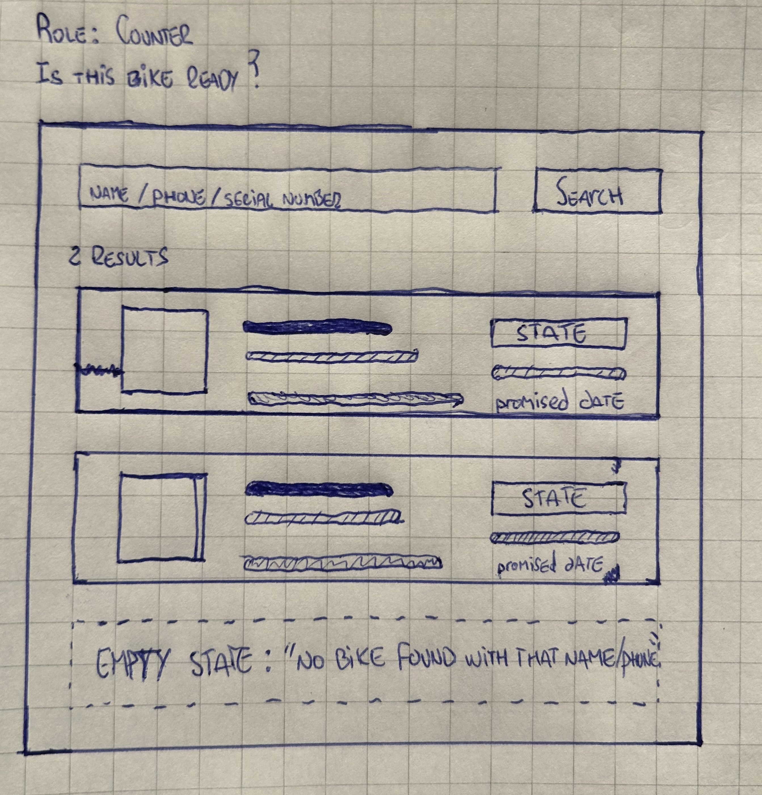
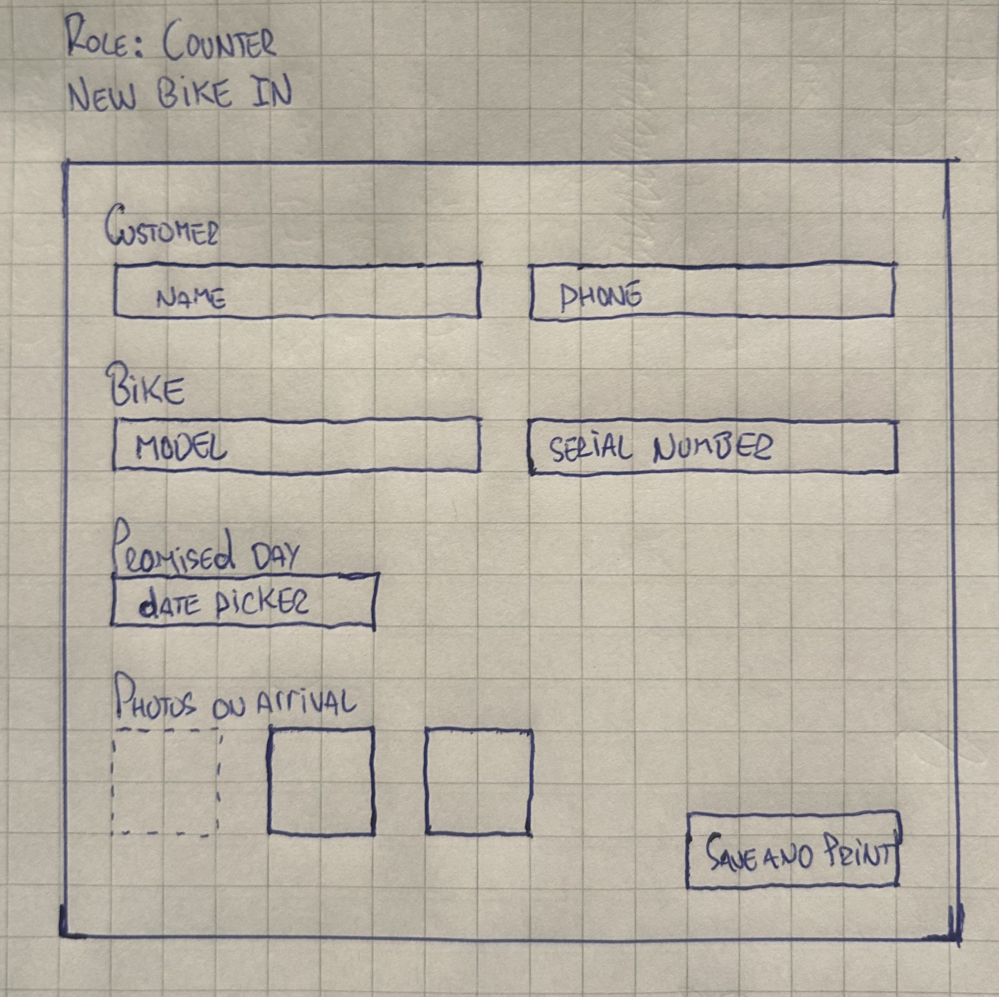
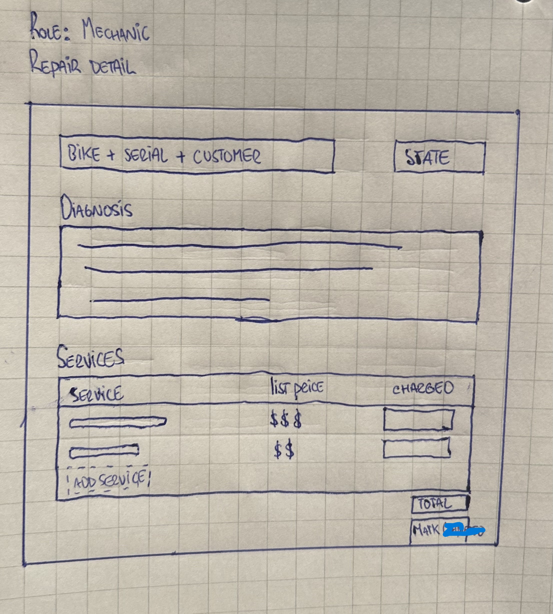
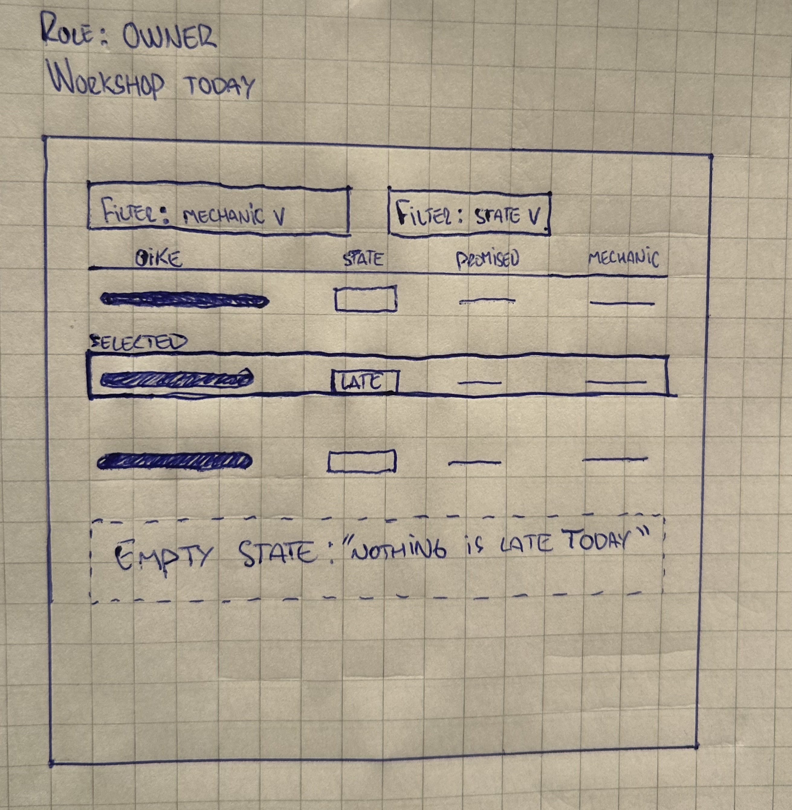
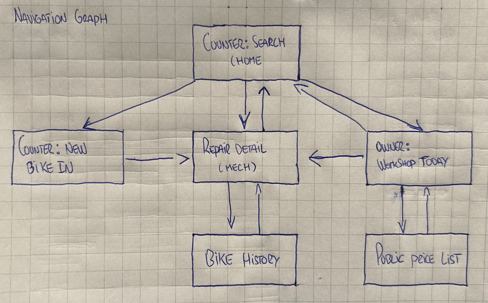

# Wireframes

Drawn on paper and photographed. Low fidelity on purpose: boxes stand for content, thick lines stand for text, dashed boxes stand for states that replace what is above them. Colour and typography are not part of the design.

Four screens are sketched. The navigation graph at the end shows six, because two of them exist in the stories and need to be reachable, but the four below are the ones this lab asks for.

## 1. Counter — is this bike ready?

The screen the daughter uses when the phone rings. One search box that takes a name, a phone or a serial number, because whoever calls will offer whichever they remember. Each result shows the state and the promised date next to each other, which is the whole question being asked. Two bikes on the same phone number come back as two rows with two serial numbers — the case the shop got wrong in March.

The dashed block is the empty state. It replaces the result rows rather than sitting underneath them.

## 2. Counter — new bike in

The paper tag, on a screen. The model is chosen from a list rather than typed, so the same model is always written the same way and two Marlins are recognisably the same model. The serial number is required and the form does not save without it. Photos are attached here, at arrival, because that is the only moment they prove anything.

## 3. Mechanic — repair detail

This screen is what replaces the notebook. The diagnosis is a text area with no length limit, so a mechanic can write a paragraph rather than four words. Each service line shows the list price and the charged price as two separate columns: the charged one is editable, the list one is not. The total sits under the charged column and is the sum of it — it is not stored anywhere.

## 4. Owner — workshop today

Every repair in the shop at once. The heavier row is one whose promised day has passed and which nobody has collected. Filters by mechanic and by state sit above the table, and any row opens the repair detail.

The dashed block is the empty state for the late case. When nothing is late the screen says so, because a blank space would leave the owner unsure whether the screen had failed.

## Navigation graph

The counter search is the home screen. Every screen is reachable from it, directly or through one hop, and every screen has a path back — no dead ends.

Two nodes have no sketch above. Bike history is reached from a repair and returns to it; it is the screen behind the split story about seeing what was done to a bike before. The public price list is the only screen anyone can reach without being in the shop, which is the one thing the owner wanted to make public.